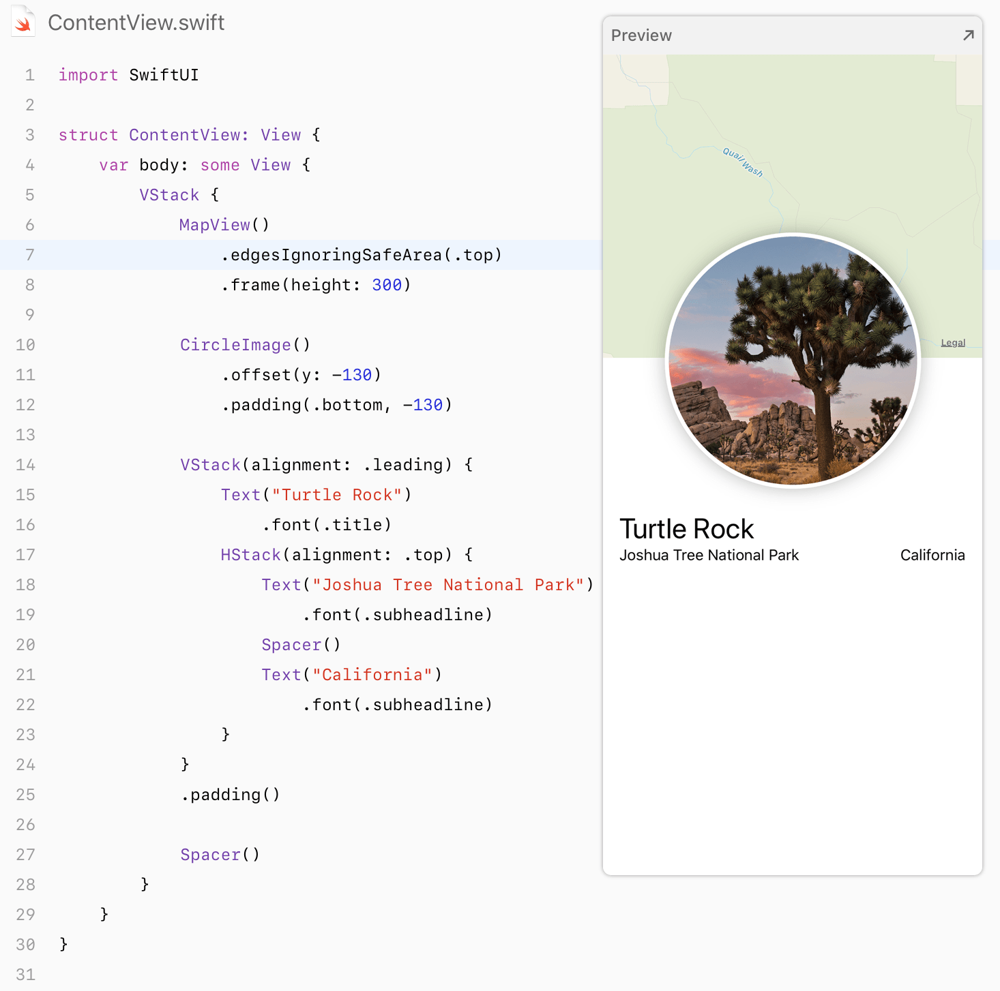
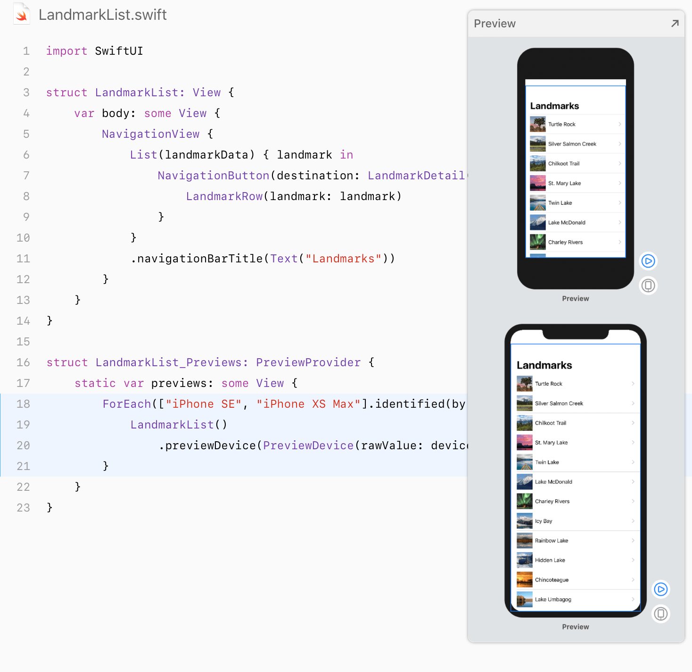
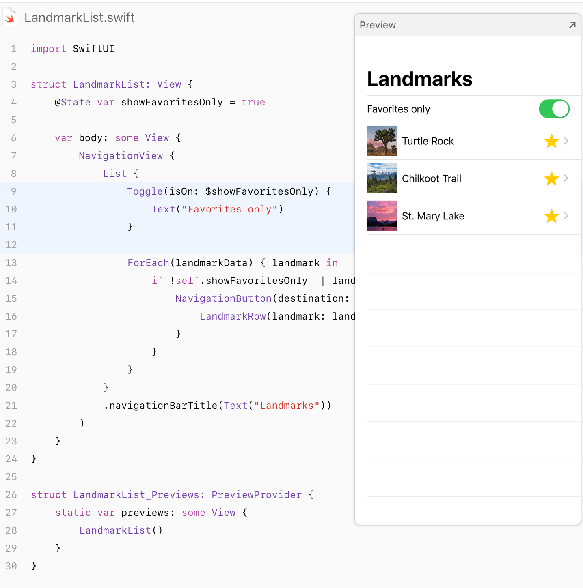
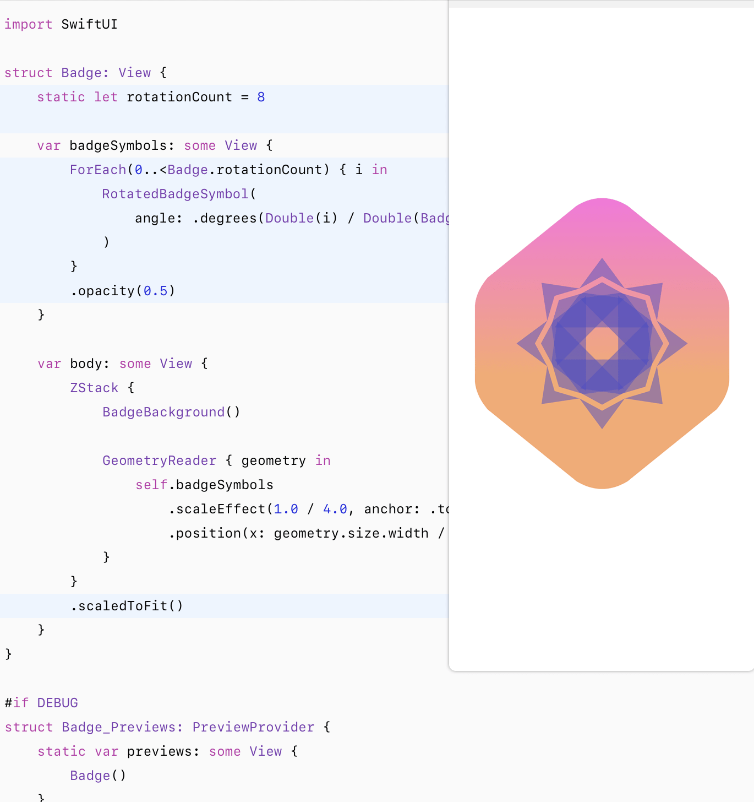
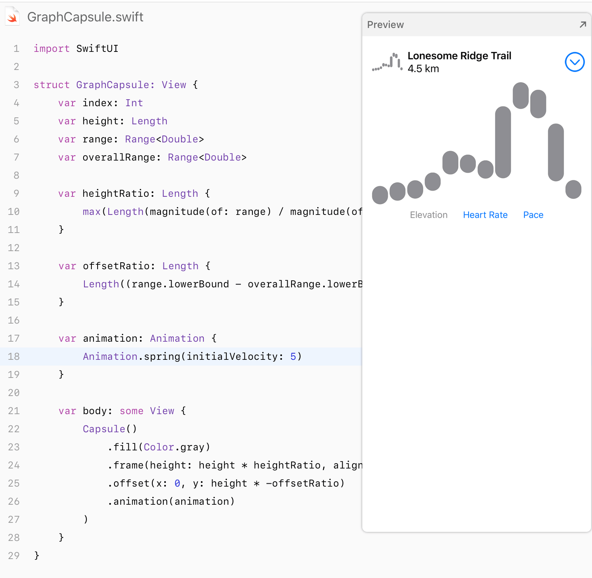
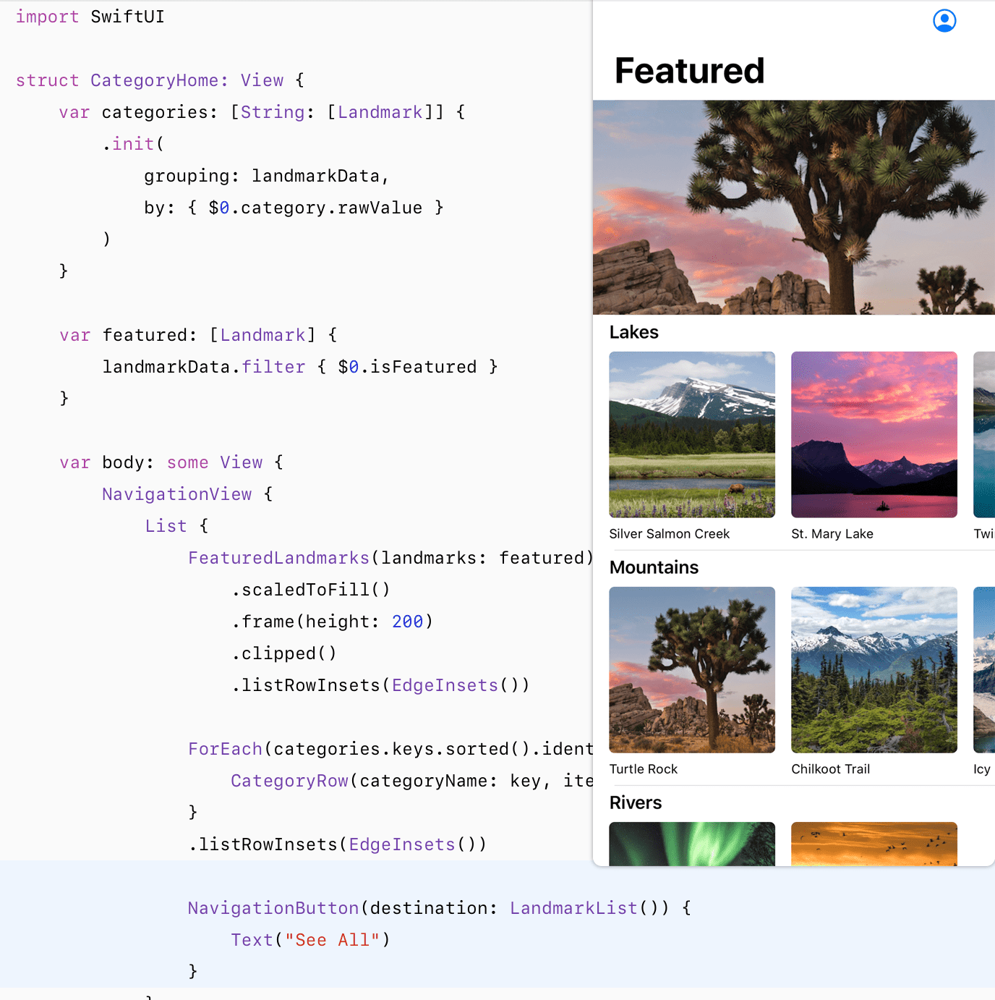
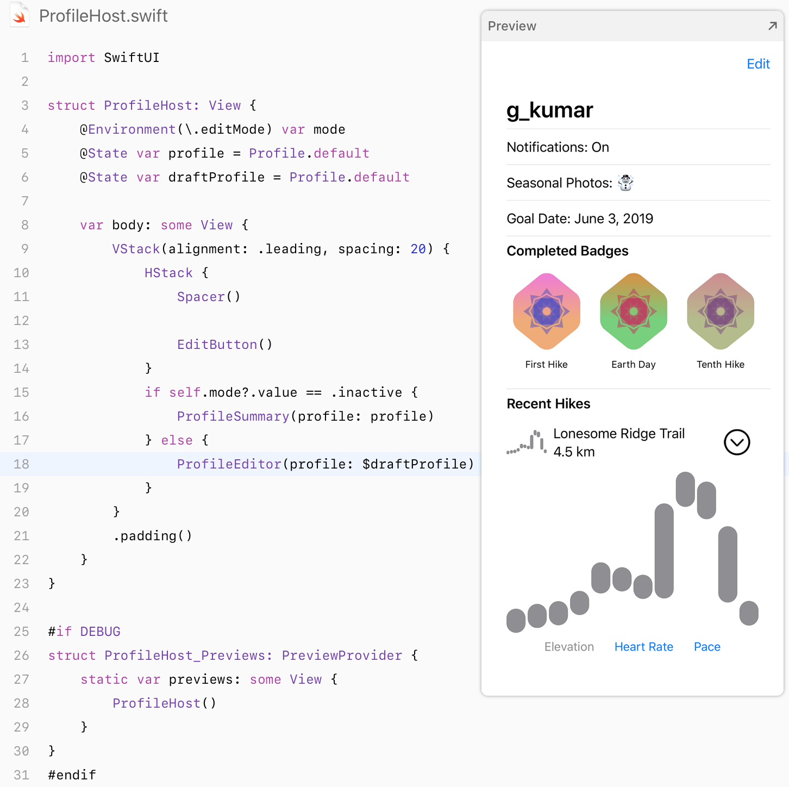
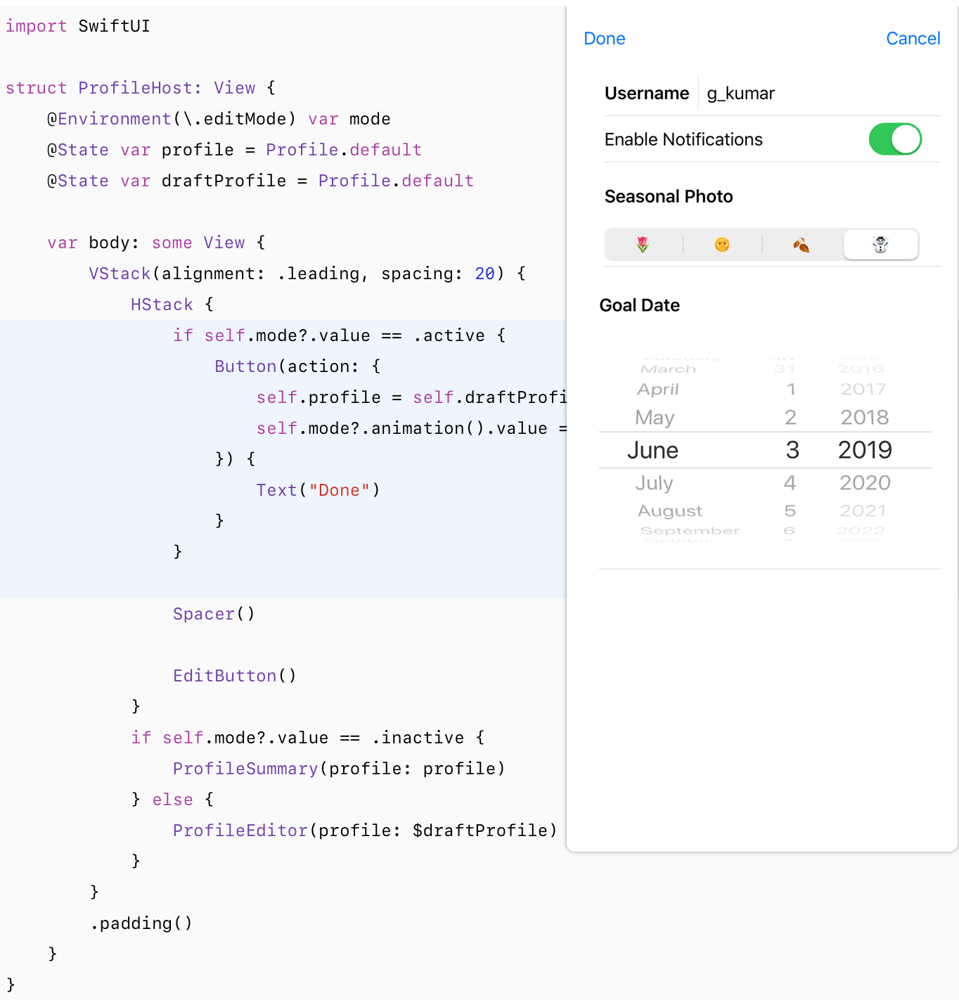
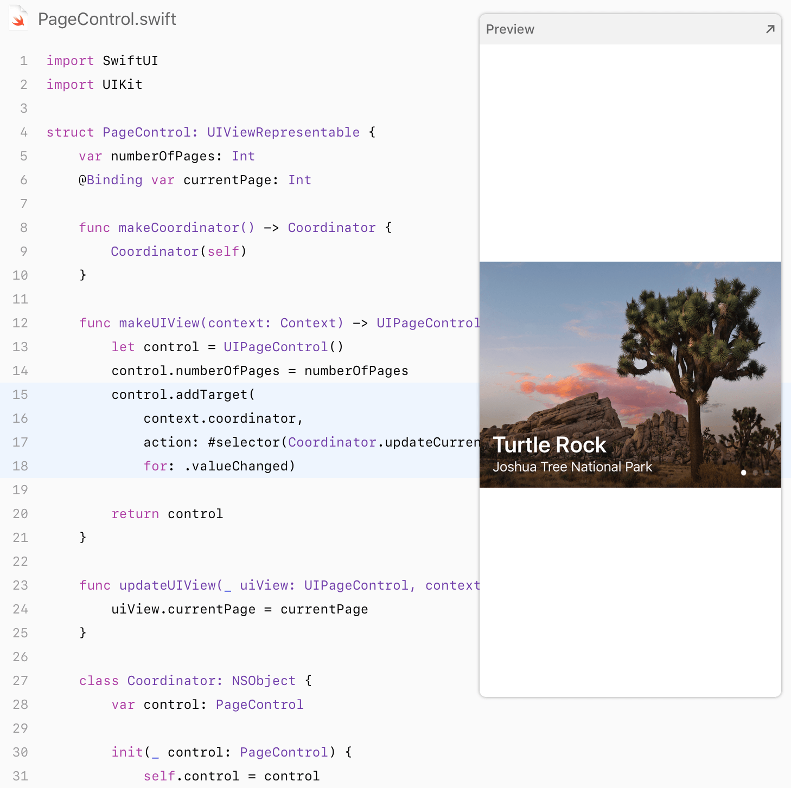

  

`SwiftUI-Sample` is a modern way to declare user interfaces for any Apple platform. Create beautiful, dynamic apps faster than ever before.

This is some of the official examples of the SwiftUI layout framework for the full platform of the apple released by [**WWDC2019**](https://www.apple.com/ios/ios-13-preview/) today. I hope to help you understand and learn this new layout framework!

### 💻 Requirements

- macOS 15 Beta
- Xcode 11.0 Beta
- iOS 13.0 Beta

### SwiftUI Essentials

Creating And Combining Views

Building Lists And Navigation

Handling User Input

### Drawing and Animation

Drawing Paths And Shapes

Animating Views And Transitions

### App Design and Layout

Composing Complex Interfaces

Working With UIControls

### Framework Integration

Interfacing With UIKit

For more information, please visit [SwiftUI Website:](https://developer.apple.com/tutorials/swiftui)

If you have a better reference example, look forward to sharing it and working hard for open source!

## ✉️ Contacts

email : amir.dalirii69@gmail.com

linkedIn : https://linkedin.com/in/amir-daliri-560697119
